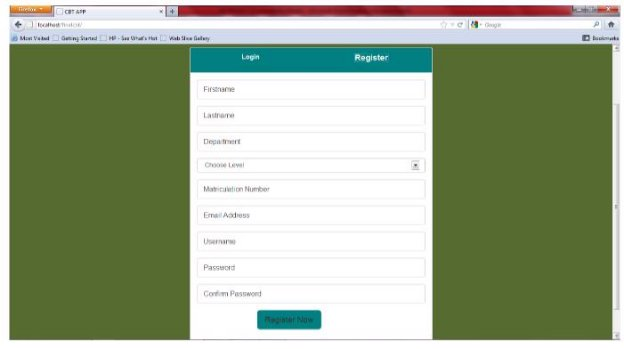
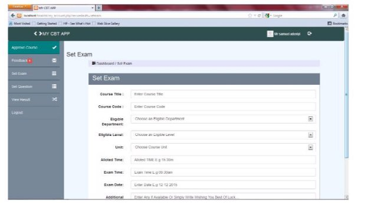
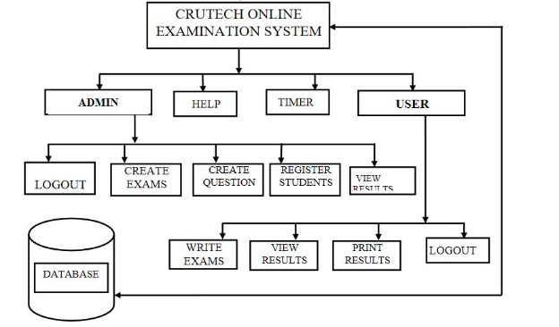

# online-examination

Online examination system project description

A complete Java web application using JSF & Hibernate. Which is implemented to perform the online examination for the student. Where an admin can add questions and Types of the examination depends on the category. As a user students can view those exams. The user can submit after finishing the exam and get results. 

**Project Modules:** 

**Login and registration:** To access the exam user must be registered in the application. Once the user will register in the examination system project, he will be able to view all exams. The user can choose an exam and start the test. 

**Admin:** 

Admin can add the exam type. Questions in existing exam and admin can modify complete database Like add user, delete the user, add new exams, Add question answer, and so on. 

**User:** 

The user can view all the tests (Exams). The user can check the result history. Minimum Requirements: 

1. Class diagram. 
1. Minimum 5 Pages and navigations between them. 
   1. One page should include a data table with edit and delete columns. 
   1. One page should include master-detail data table. 
1. Side Menu 
1. Login page 
1. Arabic/English messages. 
1. Growl Messages for Successful/Failed operations using (primefaces). 
1. Validation for any required input 

Helper screens (JUST Hint): 

Just Hint 

**Online Examination System **
